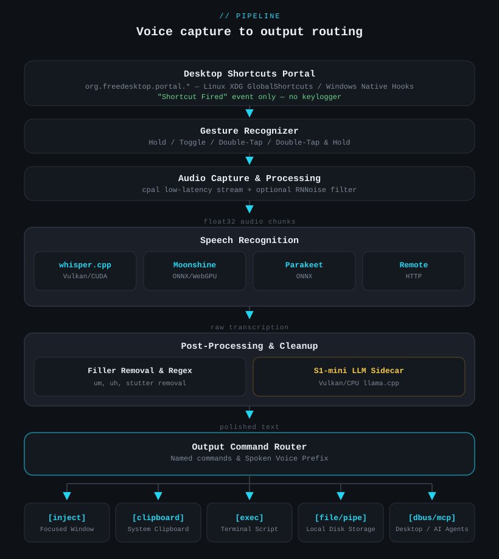

# FotonVoice Engine


A high-performance, private, on-device voice-to-text dictation application and programmable **voice input broker** built natively with **Rust**, **Tauri 2**, and **Svelte 5**.

**Zero Telemetry - Zero Cloud - 100% On-Device** *(or Bring Your Own Homelab/Server STT)*

FotonVoice Engine acts as an intelligent desktop voice gateway, routing speech to any destination-typing directly into focused windows, invoking terminal agents, appending to journals, triggering shell commands, streaming to webhooks, or feeding local AI assistants.

---

## * Key Features

* **High-Performance Offline Speech Recognition**:
  * **whisper.cpp**: Native local inference via `whisper-rs` (GGUF models) with Vulkan/CUDA GPU compute and CPU fallback.
  * **Moonshine**: Streaming ONNX speech recognition with WebGPU Direct3D 12 acceleration on Windows and CPU execution on Linux.
  * **Parakeet TDT**: Ultra-fast non-autoregressive transcription via NVIDIA Parakeet ONNX models.
  * **Remote Speech Engine**: Offload transcription to any OpenAI-compatible `/v1/audio/transcriptions` network endpoint (Faster-Whisper, vLLM, Whisper standalone, or cloud APIs) with zero local RAM/VRAM overhead.
* **On-Device S1-mini Dictation Cleanup**:
  * Intelligent text normalization powered by Superwhisper's [s1-mini](https://huggingface.co/superwhisper/s1-mini-GGUF) (~480 MB download).
  * Runs in an isolated `fotonvoice-llm-sidecar` process using `llama.cpp` with Vulkan GPU offload and automatic CPU fallback.
  * Cleans spoken self-corrections, fixes punctuation and casing, and strips filler words while strictly preserving command keywords.
* **Programmable Output Command Router (11 Delivery Targets)**:
  * Route dictation to focused windows (`inject`), system clipboard (`clipboard`), shell commands (`exec`), FIFO pipes (`pipe`), TCP/Unix sockets (`socket`), markdown files (`file`), desktop bus (`dbus`), HTTP APIs (`http`), HMAC-signed webhooks (`webhook`), audio playback (`speak`), or conversational LLMs (`chat`).
  * **Spoken Voice Commands**: Say *"FotonVoice Engine notes, meeting recap"* to dynamically dispatch text to the command named **notes**.
  * **Multi-Target Broadcasting**: Bind a single hotkey gesture to broadcast a single dictation sequentially to multiple output targets.
* **Neural Text-to-Speech (TTS) Suite**:
  * 6 offline voice engines: **Breeze-TTS-2** (voice cloning), **VoxCPM2** (OpenBMB voice cloning), **Pocket-TTS** (voice cloning from reference clip), **Piper** (high-quality ONNX), **Inflect-Micro-v2** (ultra-lightweight 38 MB ONNX), and **eSpeak-NG** (instant fallback).
  * **On-Demand Memory Mode**: Automatically unloads heavy TTS neural models from RAM/VRAM after a configurable idle period (`tts.idle_unload_secs`).
* **Heads-Up HUD Overlay & Visuals**:
  * Transparent, click-through, voice-reactive animated HUD overlays with 4 distinct styles: **Ocean Wave** (tide pool with bobbing buoy), **Voice Card** (holographic card with 20x6 VU meter), **Waveform** (oscilloscope CRT trace), and **Pulse Ring** (sonar radar dial).
  * Floating command trigger HUD pills (`! TARGET > Text`) showing dispatched actions.
* **Privacy-Preserving Global Hotkeys**:
  * Registered via the XDG `GlobalShortcuts` portal on Linux (Wayland & X11) and native hooks on Windows.
  * FotonVoice Engine never monitors your keyboard keystrokes-the desktop simply notifies FotonVoice Engine when its registered shortcut is triggered.
  * Supports `hold`, `toggle`, `double_tap`, and `double_tap_hold` gestures.
* **Built-in Model Context Protocol (MCP) Server**:
  * Local JSON-RPC server (`/tmp/fotonvoice-mcp.sock` on Linux or named pipe on Windows) exposing `transcribe_voice`, `speak_text`, and `get_status` tools to AI clients like Claude Desktop and Cursor.

---

##  Output Routing Targets

FotonVoice Engine turns your voice into a programmable router via `targets.toml`:

| Delivery Type | Mechanism | Primary Use Case |
| :--- | :--- | :--- |
| **`inject`** | Keystroke simulation via native `wtype` (Wayland), `xdotool` (X11), or `SendInput` (Windows). | Standard dictation directly into any active editor, browser, or terminal. |
| **`clipboard`** | System clipboard population via `arboard`. | Quiet copying of notes, code snippets, or templates without modifying cursor focus. |
| **`exec`** | Spawns shell command with `{TEXT}` substitution (`shell=False` safety). | CLI automation (`git commit -m "{TEXT}"`, piping into local tools, web searches). |
| **`pipe`** | Writes transcription bytes to a local named FIFO pipe. | Interfacing with shell scripts, terminal agents, and background listeners. |
| **`socket`** | Streams text over TCP or Unix Domain Sockets. | Daemons, remote servers, containers, or background dev environments. |
| **`file`** | Appends transcriptions to files with prefixes and UTC timestamps. | Hands-free journaling, meeting logs, daily standup notes, or task lists. |
| **`dbus`** | Emits custom `ai.fotonvoice.Dictation` DBus signals on the session bus. | Desktop notification triggers, system scripts, and desktop widget updates. |
| **`http`** | Dispatches HTTP POST/GET requests formatted with JSON payloads. | Webhooks, database ingestion pipelines, and REST service integration. |
| **`webhook`** | Dispatches HMAC-SHA256 signed HTTP POST requests. | Secure smart home automation triggers (e.g., Home Assistant) and secure APIs. |
| **`speak`** | Synthesizes speech aloud via the configured neural TTS engine. | Hearing spoken confirmation or audio feedback loopback. |
| **`chat`** | Multi-turn conversation with an OpenAI-compatible `/v1/chat/completions` API. | Conversational voice assistant talking directly to local LLMs (Ollama, llama.cpp). |

---

##  Architecture

FotonVoice Engine is designed with strict modularity, memory isolation, and high concurrency across 15 specialized Rust workspace crates:



### Workspace Crates

| Crate | Responsibility |
| :--- | :--- |
| **`fotonvoice-app`** | Tauri 2 application shell, Svelte IPC commands, system tray, and window management. |
| **`fotonvoice-core`** | Shared domain types, audio buffer representations, and engine traits. |
| **`fotonvoice-audio`** | `cpal` audio input stream, ring buffers, device enumeration, VAD, and RNNoise. |
| **`fotonvoice-inference`** | Multi-engine STT runner (`whisper.cpp`, `Moonshine`, `Parakeet TDT`, and remote HTTP). |
| **`fotonvoice-llm-sidecar`** | Independent companion process running `llama.cpp` (`llama_cpp_2`) with Vulkan GPU offload and CPU fallback for S1-mini text cleanup. |
| **`fotonvoice-llm`** | IPC client communicating with `fotonvoice-llm-sidecar` and external OpenAI-compatible LLM endpoints. |
| **`fotonvoice-routing`** | 11-way delivery router, voice command prefix matcher, and multi-target dispatch. |
| **`fotonvoice-hotkeys`** | XDG Desktop Portal `GlobalShortcuts` integration and gesture state machine. |
| **`fotonvoice-tts`** | Neural TTS orchestration (Breeze-TTS-2, VoxCPM2, Pocket-TTS, Piper, Inflect, eSpeak) and idle memory unloading. |
| **`fotonvoice-inject`** | Wayland (`wtype`) and X11 (`xdotool`) simulated keyboard typing. |
| **`fotonvoice-winput`** | Windows native typing via `SendInput` (`KEYEVENTF_UNICODE`) with clipboard fallback. |
| **`fotonvoice-mcp`** | Native Model Context Protocol (MCP) JSON-RPC server and client. |
| **`fotonvoice-config`** | Hot-reloadable TOML and JSON configuration management and validation. |
| **`fotonvoice-text`** | Text normalization, filler-word sanitization, and regex replacement filters. |

---

##  Installation

Pre-built binaries are available on the [Latest Releases](https://github.com/chezhenkie/fotonvoice-engine/releases/latest) page.

### Linux

1. Download **`fotonvoice-engine-linux-x86_64-vulkan.AppImage`** or the **`.deb`** package from [Releases](https://github.com/chezhenkie/fotonvoice-engine/releases/latest).
2. Make it executable and run:
   ```bash
   chmod +x fotonvoice-engine-linux-x86_64-vulkan.AppImage
   ./fotonvoice-engine-linux-x86_64-vulkan.AppImage
   ```
   *The AppImage automatically utilizes Vulkan GPU acceleration if available, falling back gracefully to CPU compute.*
3. Open the tray icon to configure engines, hotkeys, and voices.

### Windows

1. Download the installer from [Releases](https://github.com/chezhenkie/fotonvoice-engine/releases/latest):
   * **`fotonvoice-engine-windows-x86_64.exe`**: Standard edition (CPU inference for all engines).
   * **`fotonvoice-engine-windows-x86_64-webgpu.exe`**: GPU-accelerated edition (Direct3D 12 WebGPU acceleration for Moonshine).
2. Run the installer and launch FotonVoice Engine from the Start Menu or System Tray.---

##  Building from Source

### Prerequisites

* **Rust**: `rustup default stable` (1.80+)
* **Node.js & npm**: Node.js 18+ and npm
* **CMake**: Required for building `whisper-rs` and `llama.cpp`

#### Linux Dependencies
Install required system packages:
* **Ubuntu / Debian**:
  ```bash
  sudo apt install -y build-essential cmake pkg-config libasound2-dev libvulkan-dev shaderc \
                      libssl-dev libglib2.0-dev libwebkit2gtk-4.1-dev libgtk-3-dev squashfs-tools
  # Runtime injection helpers (install at least one):
  sudo apt install -y wtype    # For Wayland
  sudo apt install -y xdotool  # For X11
  ```
* **Arch / CachyOS**:
  ```bash
  sudo pacman -S --needed base-devel cmake pkg-config alsa-lib vulkan-headers shaderc \
                          openssl glib2 webkit2gtk-4.1 gtk3 squashfs-tools wtype xdotool
  ```
* **Fedora**:
  ```bash
  sudo dnf install -y gcc-c++ cmake pkgconfig alsa-lib-devel vulkan-headers shaderc \
                      openssl-devel glib2-devel webkit2gtk4.1-devel gtk3-devel squashfs-tools wtype xdotool
  ```

#### Windows Dependencies
* [Visual Studio 2022 C++ Build Tools](https://visualstudio.microsoft.com/visual-cpp-build-tools/) (MSVC `cl.exe`)
* [CMake](https://cmake.org/download/) added to system `PATH`
* [Vulkan SDK](https://vulkan.lunarg.com/) (recommended for S1-mini GPU acceleration)

---

### Building on Linux

#### 1. Development Mode (with Live Reload)
```bash
git clone https://github.com/chezhenkie/fotonvoice-engine.git
cd FotonVoice Engine
npm install
cargo tauri dev
```

#### 2. Standalone Portable AppImage (Recommended)
Compile the standalone, hardware-accelerated, self-contained AppImage:
```bash
./build_appimage.sh
```
*This compiles `fotonvoice-llm-sidecar` and `fotonvoice-engine`, packages frontend assets, bundles required GTK/WebKit helpers, applies host-fallback library stripping, and outputs `fotonvoice-engine-linux-x86_64-vulkan.AppImage` in the root folder.*

#### 3. Standard Production Build (deb & AppImage)
```bash
npm run build
cargo build --bin fotonvoice-llm-sidecar --release --features vulkan
npx tauri build --features vulkan
```

---

### Building on Windows

Open an **x64 Native Tools Command Prompt for VS 2022**:

#### 1. Standard CPU Build
```bash
git clone https://github.com/chezhenkie/fotonvoice-engine.git
cd FotonVoice Engine
npm install
npm run build
cargo build --bin fotonvoice-llm-sidecar --release
npx tauri build --bundles nsis
```

#### 2. GPU-Accelerated Build (WebGPU Direct3D 12)
Enables Direct3D 12 GPU acceleration for Moonshine via WebGPU and Vulkan for S1-mini:
```bash
npm run build
cargo build --bin fotonvoice-llm-sidecar --release --features vulkan
npx tauri build --bundles nsis --features moonshine-webgpu
```
The resulting installer is saved to `src-tauri/target/release/bundle/nsis/`.

---

##  Configuration

Configuration files are located in `~/.config/fotonvoice-engine/` (Linux) or `%APPDATA%\fotonvoice-engine\` (Windows). Changes hot-reload immediately.

### `config.json` (Core Application Settings)
```json
{
  "engine": {
    "backend": "moonshine",
    "moonshine": { "model_size": "base", "language": "en" },
    "whisper_cpp": { "model_size": "base", "device": "auto" },
    "parakeet": { "model_size": "tdt-0.6b-v3", "language": "auto" },
    "remote_openai": {
      "endpoint": "http://192.168.1.50:8000/v1",
      "model": "whisper-1",
      "timeout_secs": 30
    },
    "s1_mini": { "enabled": true, "styling": "semi-formal" }
  },
  "tts": {
    "engine": "pocket_tts",
    "memory_mode": "on_demand",
    "idle_unload_secs": 60
  },
  "ui": {
    "overlay_style": "ocean_wave",
    "command_overlay_duration_secs": 3.0
  }
}
```

### `targets.toml` (Output Routing Commands)
```toml
format_version = "1.1"

[[target]]
id = "default"
label = "Active Window"
delivery = "inject"

[[target]]
id = "notes"
label = "Meeting Notes"
delivery = "file"
file_path = "~/Documents/meeting_notes.md"
file_prefix = "- "
file_timestamp = true

[[target]]
id = "cmd_router"
label = "Voice Command Router"
delivery = "command"    # Listens for "FotonVoice Engine <target> <text>"
```

### `bindings.toml` (Global Shortcut Gestures)
```toml
format_version = "1.1"

[[binding]]
id = "dictate_hold"
label = "Dictate (Hold Space)"
keys = ["KEY_LEFTMETA", "KEY_SPACE"]
gesture = "hold"
target_id = "default"

[[binding]]
id = "type_and_log"
label = "Type & Append to Journal"
keys = ["KEY_LEFTCTRL", "KEY_LEFTMETA", "KEY_SPACE"]
gesture = "hold"
target_ids = ["default", "notes"]    # Broadcasts to both targets sequentially!
```

---

##  Documentation Index

For in-depth guides, architectural references, and developer documentation:

| Guide | Description |
| :--- | :--- |
| **[Architecture](docs/architecture.md)** | Workspace crate design, concurrency model, and data flow. |
| **[Speech Recognition](docs/speech-recognition.md)** | Whisper.cpp, Moonshine, Parakeet, Remote STT, and S1-mini sidecar. |
| **[Output Routing](docs/routing.md)** | Comprehensive reference for all 11 delivery mechanisms. |
| **[Text-to-Speech](docs/tts.md)** | Engine setup, voice cloning, prompt design, and on-demand memory. |
| **[Global Hotkeys](docs/hotkeys.md)** | XDG portal shortcuts, gesture recognizer, and platform details. |
| **[Integrations](docs/integrations.md)** | Model Context Protocol (MCP), DBus, and OpenAI LLM API integration. |
| **[User Interface](docs/ui.md)** | HUD overlays, Cyber Obsidian settings dashboard, and system tray. |
| **[Configuration Reference](docs/configuration.md)** | Full schema definitions for all JSON and TOML configuration files. |
| **[Privacy & Security](docs/privacy.md)** | Data sovereignty guarantees, verification steps, and zero-telemetry architecture. |
| **[Windows Testing Guide](docs/windows_testing.md)** | Comprehensive testing matrix and validation steps on Windows 11. |
| **[Windows Build Guide](docs/windows_build.md)** | Native Windows compilation steps and toolchain setup. |
| **[Bug Reporting](docs/bug_reports.md)** | Privacy-first diagnostic generation and submission. |

---

##  License

FotonVoice Engine is open-source software licensed under the [MIT License](LICENSE).

---

## Buy me a coffee

If you find FotonVoice Engine useful, please consider supporting its development with a small contribution:

<a href="https://www.buymeacoffee.com/jrufer" target="_blank">
  
</a>

Thank you for your support! 
  