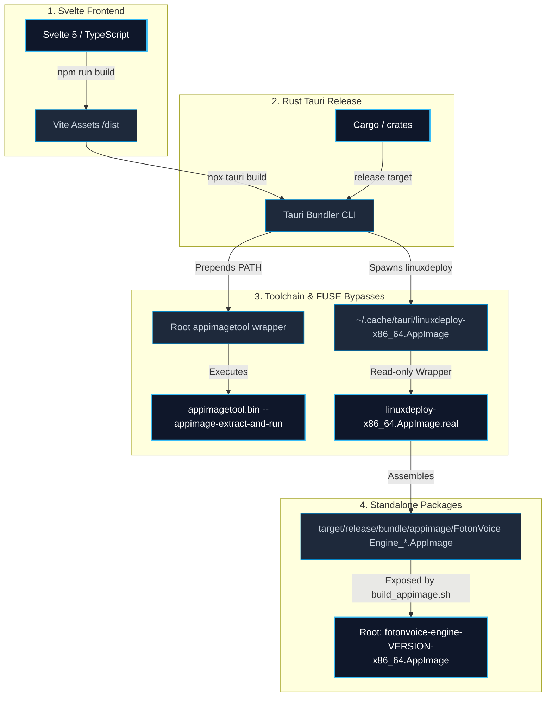

# AppImage Build & Packaging Deployment Guide

This document provides complete instructions and design details for compiling, packaging, and deploying the **FotonVoice Engine** desktop application into a portable, standalone Linux **AppImage**. It serves as an authoritative playbook for developers and automated agents to execute rapid, error-free production releases.

---

##  Packaging Architecture & Data Flow

Below is the workflow showing how the frontend, backend compiler, local system wrappers, and write-protected platform tools assemble into a portable AppImage:



---

##  Prerequisites & Host Build Environment

Before executing a build, ensure the host machine has the core compilation packages and AppImage extraction tools installed.

### System Package Requirements

| Package | Purpose | Package Name (Arch) | Package Name (Debian/Ubuntu) |
|:---|:---|:---|:---|
| **Squashfs Extraction** | Allows FUSE-less extraction of packaging AppImages. | `squashfs-tools` | `squashfs-tools` |
| **Rust Toolchain** | Rust compiler and Cargo bundle tools. | `rustup` / `rust` | `rustc` / `cargo` |
| **Node.js Environment** | Package manager and Vite bundling. | `nodejs` `npm` | `nodejs` `npm` |
| **System Webview** | Tauri interface runtime dependency. | `webkit2gtk-4.1` | `libwebkit2gtk-4.1-dev` |
| **Audio Library** | Low-latency audio capture via CPAL/ALSA. | `alsa-lib` | `libasound2-dev` |
| **Desktop Integrations**| System tray application icons support. | `libayatana-appindicator` | `libayatana-appindicator3-dev` |

### Rapid Prerequisites Install
* **Arch Linux / CachyOS**:
  ```bash
  sudo pacman -S --needed base-devel rustup nodejs npm webkit2gtk-4.1 alsa-lib libayatana-appindicator squashfs-tools
  ```
* **Ubuntu / Debian**:
  ```bash
  sudo apt-get update
  sudo apt-get install -y build-essential curl nodejs npm pkg-config libwebkit2gtk-4.1-dev libssl-dev libayatana-appindicator3-dev libasound2-dev squashfs-tools
  ```

---

##  Quick-Start Build Instructions

To build a fresh deployment AppImage, run the automated compile script from the **project root**:

```bash
chmod +x build_appimage.sh
./build_appimage.sh
```

### What `build_appimage.sh` does automatically:
1. **Toolchain Check**: Validates that `unsquashfs` is present to support FUSE-less unpacking.
2. **Frontend Compiles**: Compiles all visual assets and generates the optimized production build (`/dist`).
3. **Environment Setup**: Prepends the workspace root to the shell `$PATH` and exports `APPIMAGE_EXTRACT_AND_RUN=1` and `QT_QPA_PLATFORM=offscreen` to allow FUSE-less head-free compilation.
4. **Tauri Releases**: Runs `npx tauri build` to compile the optimized release binary and bundles it using the FUSE-bypass tools.
5. **Relocation**: Copies the completed executable dynamically using the `productName` and `version` from `tauri.conf.json` (e.g. `fotonvoice-engine-0.1.0-x86_64.AppImage`) directly to the project root, creating a convenient `fotonvoice-engine-latest-x86_64.AppImage` symlink.

---

##  Crucial Troubleshooting: Bypassing the Platform Shebang Bug

If the bundling process fails at the AppImage packaging stage with a generic system error:
```
failed to bundle project `No such file or directory (os error 2)`
```

### 1. The Root Cause (The Platform Shebang Bug)
The IDE/container sandbox environment features an automated background file-watching daemon that intercepts files inside `~/.cache/tauri/` to sanitize environment paths.
However, due to a byte-truncation bug in the platform's wrapper generator, the daemon automatically rewrites `~/.cache/tauri/linuxdeploy-x86_64.AppImage` to utilize a **corrupted interpreter shebang**:
```bash
#!/bin/b   
```
Because the Linux kernel cannot find `/bin/b` to execute the wrapper, it fails with a low-level `ENOENT` (os error 2) instantly.

### 2. The Solution (Immutable Lockdown)
To resolve this, we bypass the platform's editor hooks by writing the correct bash script directly via shell redirection and **revoking write permissions** to make it read-only. Run these commands:

```bash
# 1. Re-write the correct wrapper script directly via the shell
# NOTE: If your IDE/container injects a custom PATH entry that is being
#       written into the shebang, adjust the sed pattern below to match
#       your environment's injected bin path.
cat << 'EOF' > ~/.cache/tauri/linuxdeploy-x86_64.AppImage
#!/bin/bash
export APPIMAGE_EXTRACT_AND_RUN=1
export NO_STRIP=1
export QT_QPA_PLATFORM=offscreen
# Remove any IDE-injected PATH entries that corrupt the linuxdeploy wrapper.
# Adjust the pattern below to match your environment if needed.
export PATH=$(echo $PATH | sed 's|<YOUR_IDE_BIN_PATH>:||g')
exec "$HOME/.cache/tauri/linuxdeploy-x86_64.AppImage.real" "$@" --exclude-library=libselinux* --exclude-library=libgio* --exclude-library=*gdk_pixbuf*
EOF

# 2. REVOKE write permissions to make the file immutable to the broken platform hook
chmod 555 ~/.cache/tauri/linuxdeploy-x86_64.AppImage

# 3. Make sure the helper plugin is also protected
chmod 555 ~/.cache/tauri/linuxdeploy-plugin-appimage.AppImage
```

Once locked, the platform is physically blocked from corrupting the shebang, and `./build_appimage.sh` will bundle successfully.

---

##  Deploying onto a New Machine

To run the completed portable application on a fresh host system, follow these deployment steps:

### 1. Copy the Essential Files
You only need to transfer **one file** to the new machine:
* `FotonVoice Engine-*-x86_64.AppImage` (the versioned executable)

### 2. Run the Unified Setup
Run the built-in setup command once on the new machine to automatically pull in host runtime dependencies, install desktop icons, and write a menu launcher. Global shortcuts need no permissions - they go through the desktop portal:

```bash
chmod +x FotonVoice Engine-*-x86_64.AppImage
./FotonVoice Engine-*-x86_64.AppImage --install
```

Alternatively, you can just double-click or run the AppImage directly; FotonVoice Engine's setup window detects anything missing at startup and offers to install it.

### 3. Start Using It
Global shortcuts work immediately. FotonVoice Engine registers them with your desktop
through the XDG `GlobalShortcuts` portal, so there is no permission to grant, no
udev rule, no group membership, no logout and no reboot - and FotonVoice Engine never
reads your keyboard.

If your desktop does not implement the portal, the setup window says so at
launch and explains the options. FotonVoice Engine will not grant itself keyboard access
to work around it.

---

##  Bumping the App Version

The version number is declared independently in three places: `package.json`,
`src-tauri/tauri.conf.json` (the one that actually drives `getVersion()`, the
About tab, and the AppImage filename), and `Cargo.toml`'s
`[workspace.package]`. They've drifted before, and a release has shipped
under a git tag that didn't match what the built app actually reported.

**Always bump with the script, never by hand-editing one file:**

```bash
./scripts/bump_version.sh 0.2.8
cargo check   # refreshes Cargo.lock's recorded crate versions
git add -A && git commit -m "Bump version to 0.2.8"
```

CI (`.github/workflows/release.yml`) runs a `check-version-sync` job before
every release build that fails immediately if the three files disagree, and
rejects a manually-dispatched release tag that doesn't match the version in
the files - bump the files instead of overriding the tag.

---

##  AppImage Runtime Library Policy

The AppImage is deliberately **not** self-contained. The slimming step in
`build_appimage.sh` and `.github/workflows/release.yml` (keep the two in sync)
deletes bundled copies of libraries that must come from the host at runtime,
and `ldd -r` of every bundled object under the AppImage's own library path must
stay clean on a newer host. The rules, each learned from a startup crash:

1. **Graphics, Wayland and input libraries come from the host** (Mesa, EGL,
   libdrm, libwayland, libxkbcommon). Bundled copies from the Ubuntu 22.04
   build host break Wayland frame callbacks and xkbcommon.
2. **Once a library comes from the host, everything it links against must
   come from the host too.** The host's copy resolves its symbols against
   whatever is first on `LD_LIBRARY_PATH`; a stale bundled dependency makes it
   abort with `undefined symbol` / `version ... not found`. This is why the
   GLib family, GStreamer, the GIO TLS module and gnutls stack, and their
   dependencies (pcre2, libffi, libmount, libblkid, libselinux, liborc,
   libunwind, libdw, libelf, bz2, lzma, zstd) are all stripped together.
   Everything still bundled only needs the Ubuntu 22.04 versions of these, so
   any newer host satisfies it.
3. **Only strip a library whose soname is stable across distributions.**
   `libxml2` (`.so.16` on Arch) and `libunistring` (`.so.5` on newer hosts)
   stay bundled for that reason.
4. **Some libraries are host-first with a bundled fallback.** They live in
   `usr/lib/fallback/`, and the
   `scripts/appimage-hooks/host-first-fallback.sh` AppRun hook exposes each
   one only when the host has no library of that soname - so a host that has
   its own copy always wins, and a host that has none still starts.
   * `libsystemd` / `libudev`: Arch's `libmount` links `libsystemd`, so a
     bundled copy must not shadow the host's; but non-systemd distributions
     may not have them at all and the bundled WebKitGTK needs them.
   * `libgstgl-1.0` / `libwayland-server`: the bundled WebKitGTK links both
     directly, and rules 1 and 2 would otherwise delete them.
     `libgstgl-1.0.so.0` ships in `libgstreamer-gl1.0-0`, which
     `gstreamer1.0-plugins-base` does **not** depend on, so a desktop with no
     WebKit of its own can be missing it and the app dies with
     `error while loading shared libraries: libgstgl-1.0.so.0`.
5. **WebKitGTK finds its helper processes relative to the working
   directory.** The Tauri bundler rewrites the compiled-in
   `/usr/lib/x86_64-linux-gnu/webkit2gtk-4.1` to
   `././/lib/x86_64-linux-gnu/webkit2gtk-4.1`, and linuxdeploy's AppRun starts
   the app in `$APPDIR/usr` so that resolves. Release builds of WebKitGTK
   honour no environment override for this (`WEBKIT_EXEC_PATH` only exists in
   developer-mode builds), so the helpers must sit at exactly that relative
   path, **and nothing in the app may change the process's working
   directory.** An earlier Pocket-TTS implementation used to require a
   bundled `usr/config/` for the same reason; the current audio.cpp-backed
   engines take a `--model <dir>` argument directly and no longer touch the
   process's working directory at all.
6. **The AppImage runtime must not need FUSE 2.** appimagetool's built-in
   type-2 runtime statically links libfuse 2 and looks for a `fusermount`
   binary; Ubuntu 22.04 / Linux Mint 21 and newer ship fuse3 (`fusermount3`)
   and no `libfuse2`, so such an AppImage aborts with
   `Error: No suitable fusermount binary found on the $PATH` before it ever
   reaches `AppRun`. `scripts/appimage-pack.sh` therefore packages with
   [uruntime](https://github.com/VHSgunzo/uruntime), which speaks FUSE 3 and
   extracts-and-runs itself when no `fusermount` is usable. If that runtime
   cannot be fetched, or the AppImage built with it does not unpack again,
   packaging falls back to appimagetool's own runtime, so a build is never
   left worse off than before.

### Host baseline

The release AppImages are built on the `ubuntu-22.04` runner, which sets the
floor for what they run on: **glibc 2.35** (`hypot@GLIBC_2.35` in the overlay,
WebKitGTK and cairo) and **`GLIBCXX_3.4.30`** (GCC 12's libstdc++, needed by
`usr/bin/fotonvoice-engine` and WebKitGTK). Ubuntu 22.04+, Linux Mint 21+, Debian 12+ and
Fedora 36+ satisfy both; Ubuntu 20.04, Mint 20, Debian 11 and RHEL 9 do not.
Building locally with `build_appimage.sh` produces an AppImage with *your*
distribution's baseline - on a rolling distro that is far higher than 22.04's,
so ship CI artifacts, not local builds.

---

##  Build Flags & Config Reference

* **Tauri Config (`src-tauri/tauri.conf.json`)**:
  * `"targets": ["appimage"]`: Isolated to bundle exclusively the AppImage target. Can be set back to `"all"` to compile `.deb` and `.rpm` files if production repositories require standard package formats.
* **Environment Variables**:
  * `APPIMAGE_EXTRACT_AND_RUN=1`: Directs packaging and runtime binaries to extract themselves into `/tmp` rather than attempting FUSE mounts.
  * `QT_QPA_PLATFORM=offscreen`: Prevents Qt platform errors inside display-less or restricted terminal workspaces.
